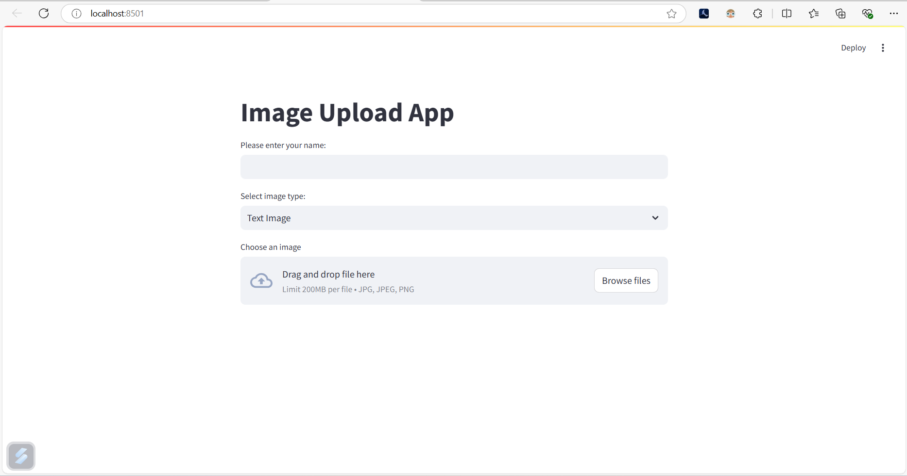
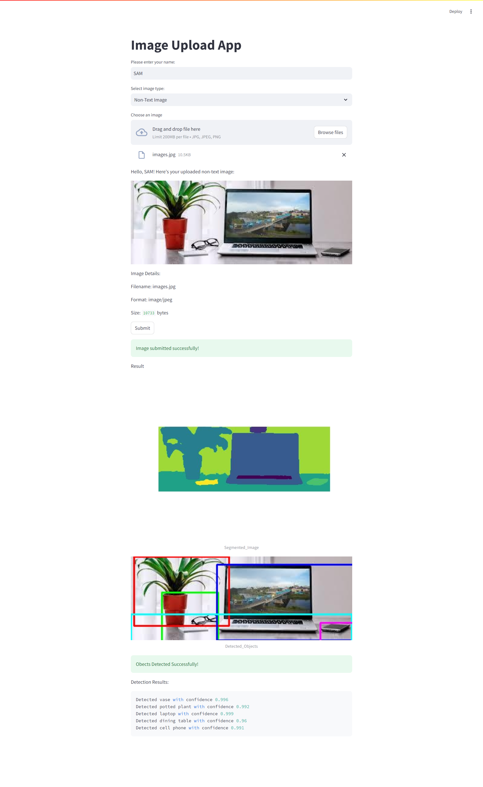
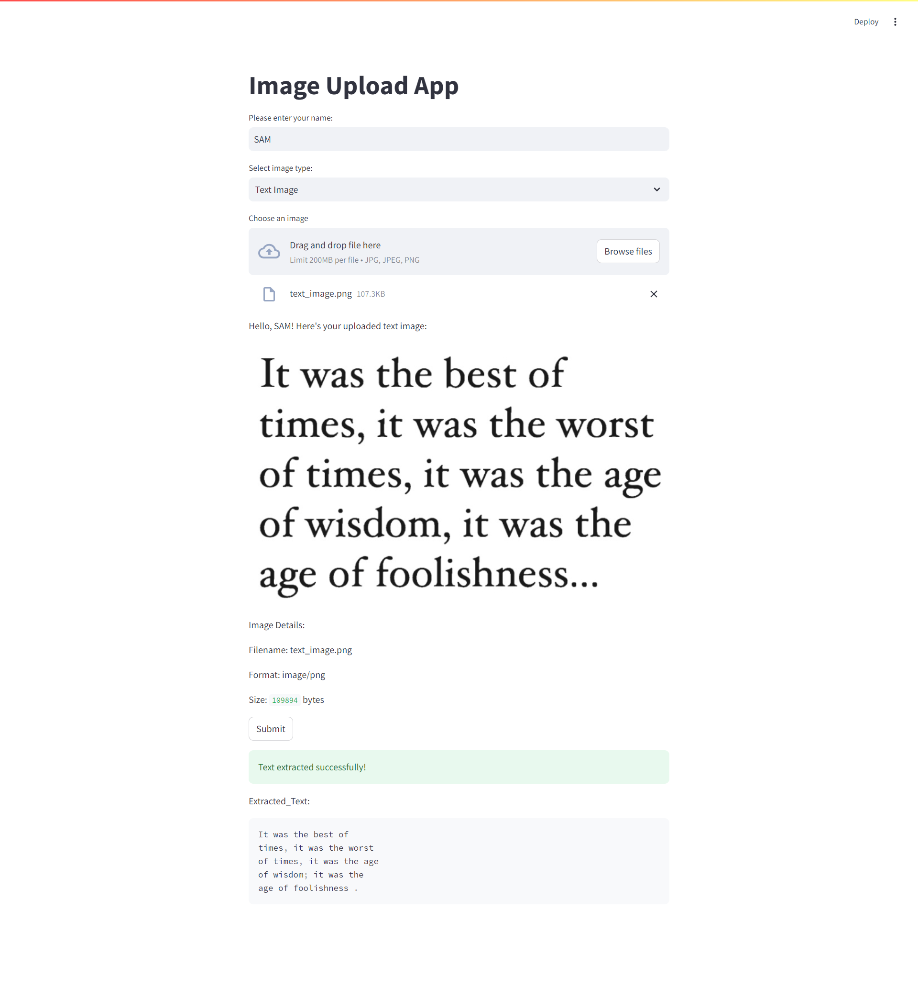

# Image_segmentation_and_analysis_and_ocr-

```
pip install --upgrade pip
```

```
python -m venv myenv
```

```
myenv\Scripts\activate
```

```
source myenv/bin/activate
```

```
pip install -r requirements.txt
```

```
python -m streamlit run app.py
```




